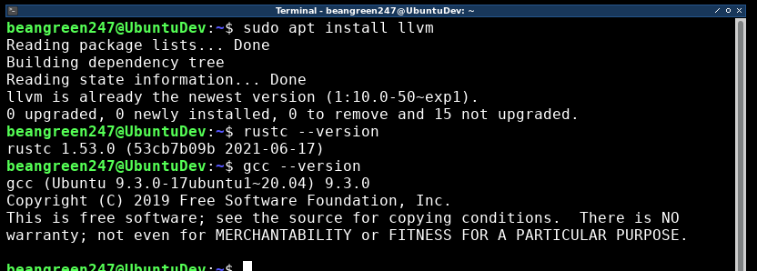

# rust-vs-c-language-speed-test
some info will be added later



source files for each test are seperated into their own directory

example for tables for each test

|language|terminal|shell|time|
|:---:|:---:|:---:|:---:|
|C|tinterm|tinshell|0:00.27|
|rust|tinterm|tinshell|0:00.38|
|C|xfce4-terminal|bash|0:00.339|
|rust|xfceč-terminal|bash|0:00.330|

MOTE
> tinshell and tinterm are tools I made and are written in C, as of now not released

it should be mentioned that the times are take by the output of the time command present in linux distros

example
```bash
time ./mainc
```
